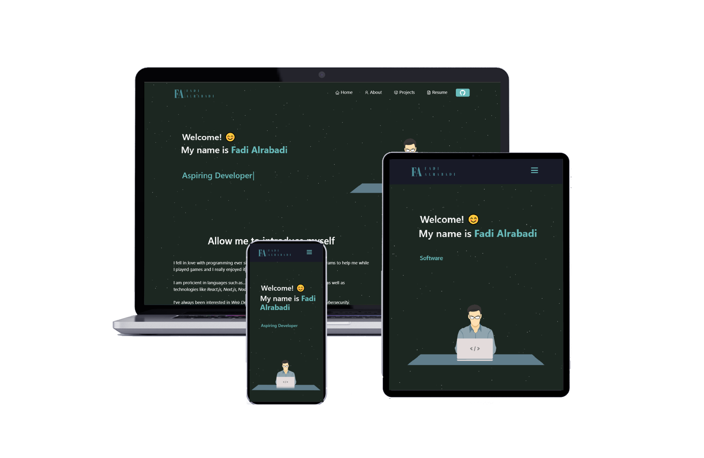

<h2 align="center">
  Fadi Alrabadi's Portfolio<br/>
  <a href="[falrabadi.github.io](https://falrabadi.github.io/)" target="_blank">falrabadi.github.io</a>
</h2>
<div align="center">
  
</div>

<br/>

## Features 📋
⚡️ Fully Responsive, built with React.\
⚡️ CI/CD pipeline through Github Actions. \
⚡️ Typing animation using `Typewriter`.\

## Run Locally 🏃

Clone the project

```bash
  git clone https://github.com/falrabadi/falrabadi.github.io
```

Go to the project directory

```bash
  cd my-project
```

Install dependencies

```bash
  npm install
```

Start the development server 

```bash
  npm start
```

## Deployment 📦
- To deploy this project, we can use [Github Pages](https://pages.github.com/).
- First, you need to create github repository with name `<your-github-username>.github.io`.
- Next, run `npm run build && npm run export` to generate your website's static files.
- Lastly, upload the contents of the `out` file to your repository and navigate to `<your-github-username>.github.io` to see your website live.
- I would recommend building a CI/CD pipeline through Github actions to automate the build and export process. [Here](https://github.com/marketplace/actions/deploy-to-github-pages) is a useful article to get started.

## Sections 📚
✔️ Home \
✔️ About \
✔️ Projects \
✔️ Resume

## Tech Stack 🛠️
* _Node.js_
* _React.js_
* _Express.js_
* _CSS3_
* _Bootstrap_
* _Github Pages_
* _Github Actions (CI/CD)_
